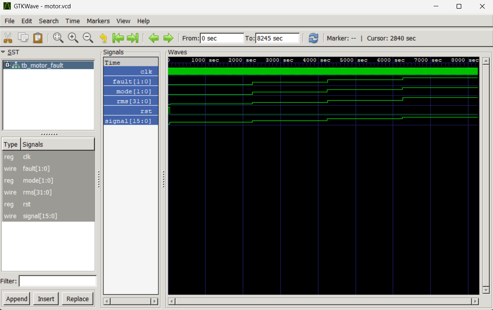
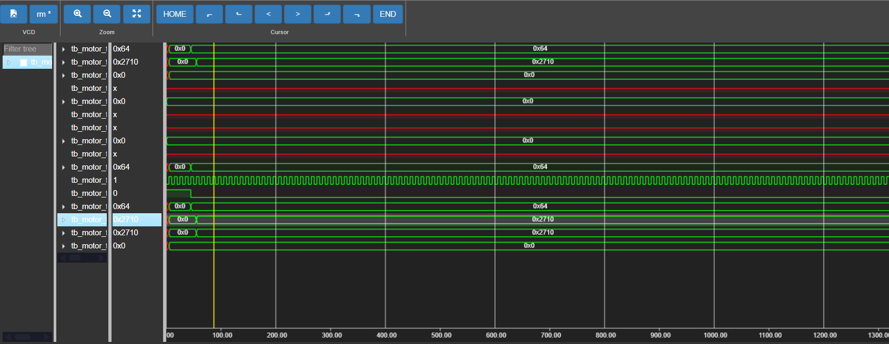

  # Industrial Motor Fault Simulation & Analysis 

> A simulation-based project for analyzing and visualizing industrial motor fault conditions using signal processing concepts and hardware description language (HDL).
> 


---

## Project Overview
Industrial motors are vital components in automation and manufacturing systems. Early fault detection helps prevent unexpected failures, reduce maintenance costs, and improve system reliability.

This focuses on simulating **industrial motor behavior under different operating and fault conditions** using **Verilog** and analyzing the generated signals using **Python-based tools**. The motor signals are visualized through **GTKWave**, enabling clear observation of fault characteristics at the hardware level.

---

## Objectives
- Simulate industrial motor signals under healthy and faulty conditions  
- Model motor faults using Verilog HDL  
- Generate and analyze waveform data (VCD files)  
- Visualize motor behavior using GTKWave  
- Perform feature extraction and comparison using Python  

---

## Conditions Simulated
- ✅ Healthy Motor  
- ⚠️ Bearing Fault  
- ⚠️ Rotor Fault  
- ⚠️ Motor Aging / Degradation  

---

## Technologies & Tools
| Category | Tools |
|--------|------|
| HDL | Verilog |
| Simulation | Icarus Verilog |
| Waveform Viewer | GTKWave |
| Programming | Python |
| IDE | VS Code |
| Platform | Windows |

---

## Project Structure
```bash
Industrial-Motor-Fault-Simulation/
│
├── iverilog/
│   ├── motor_signal.v        # Motor signal generation
│   ├── feature_extract.v    # Feature extraction logic
│   ├── classifier.v         # Fault classification module
│   ├── tb_motor_fault.v     # Testbench
│   ├── motor.vcd            # Waveform output
│
├── jupyterVisualization/
│   ├── Aging.ipynb
│   ├── Analysis.ipynb
│   ├── Compare.ipynb
│   ├── MotorFault.ipynb
│
├── README.md
└── a.out
```
## Waveform Visualization (GTKWave)

### Final Interpreted Result

 **final interpreted waveform** obtained from the Verilog-based industrial motor fault simulation.  


---

### Raw Simulation Output (VCD)

**raw simulation waveform** generated directly from the Verilog testbench and stored in the `motor.vcd` file.  
This raw output captures low-level signal transitions and serves as the input for GTKWave-based analysis.



---

## Python-Based Signal Analysis

Post-simulation analysis is carried out using **Python (Jupyter Notebooks)** to extract meaningful information from the generated motor signals. The analysis includes:

- Visualization and comparison of motor signals across different conditions  
- Statistical feature extraction, including:
  - Mean  
  - Variance  
  - Skewness  
- Trend analysis to study the impact of faults on motor performance  

This combined approach enables effective correlation between **hardware-level simulation results** and **software-based fault diagnostic techniques**.

---

## Future Enhancements

- Integration with real-time motor sensor data  
- Implementation of fault detection logic on FPGA platforms  
- Application of machine learning techniques for automated fault classification  
- Modeling and analysis of multi-phase industrial motors  
- Hardware-level optimization of feature extraction algorithms  

---

## Author
**Vivek Rao❣️**    
🔗 GitHub: https://github.com/vivekrao0205


