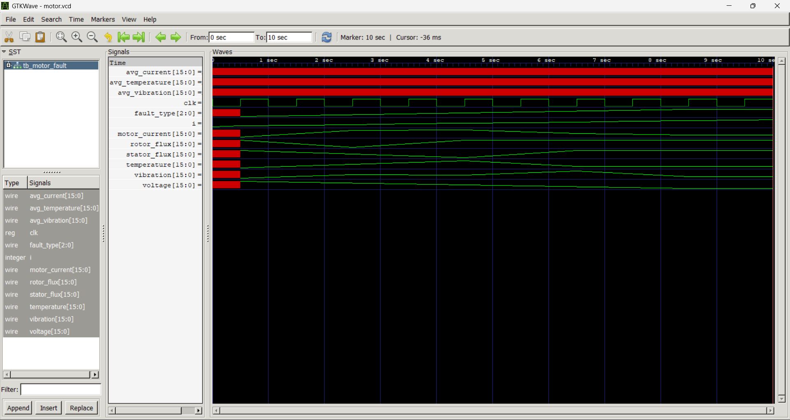
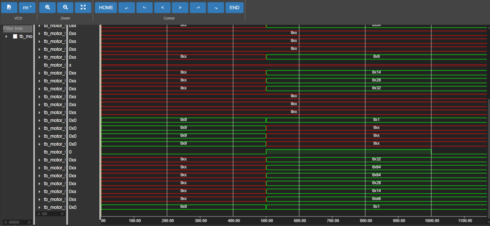

# Industrial Motor Fault Simulation 
<div align="center">

</div>

> A hardware-level simulation framework for modeling, detecting, and visualizing industrial motor fault conditions using Verilog HDL and signal analysis techniques.
> 


---

# Projet Overview  

Industrial motors are critical assets in automation, manufacturing, and power systems.  
Unexpected failures result in downtime, maintenance costs, and production losses.

This project simulates **real-time motor behavior under multiple fault scenarios** using:

- Verilog HDL for signal modeling  
- Icarus Verilog for simulation  
- GTKWave for waveform visualization  
- Python for feature extraction and analysis  

---

# Objectives  

- Model industrial motor electrical and mechanical signals  
- Inject structured fault conditions over time  
- Generate VCD waveform outputs  
- Visualize hardware-level signal transitions  
- Implement rule-based intelligent fault classification  
- Analyze behavior using Python-based tools  

---

# Conditions Simulated  

| Fault Type            | Code | Description              |
|-----------------------|------|--------------------------|
| Healthy               | 000  | Normal motor operation   |
| Rotor Fault           | 001  | Broken rotor bar         |
| Stator Fault          | 010  | Winding short circuit    |
| Bearing Fault         | 011  | Mechanical vibration     |
| Unbalanced Supply     | 100  | Voltage imbalance        |
| Overload Condition    | 101  | Excess mechanical load   |

---

# System Architecture  

```
Motor Signal Generator
        │
        ▼
Feature Extraction Module
        │
        ▼
Rule-Based Intelligent Classifier
        │
        ▼
3-Bit Fault Code Output
```

### Module Roles

- **motor_signal.v** → Generates dynamic motor parameters  
- **feature_extract.v** → Computes averaged and filtered values  
- **classifier.v** → Encodes fault logic using threshold-based rules  
- **tb_motor_fault.v** → Simulation driver  

The architecture is deterministic, hardware-friendly, and FPGA-ready.

---

# Fault Behavior   

| Fault State | Code | Electrical Behavior | Mechanical Behavior | Detection Logic |
|-------------|------|--------------------|--------------------|-----------------|
| Healthy | 000 | Current 40–60 A<br>Stable flux | Low vibration<br>Temp 30–50°C | All values within threshold |
| Rotor Fault | 001 | High current<br>Low rotor flux | Moderate vibration | Electromagnetic imbalance |
| Stator Fault | 010 | High current<br>Low stator flux | High temperature | Winding stress |
| Bearing Fault | 011 | Flux stable | Very high vibration<br>Slight temp rise | Mechanical instability |
| Voltage Fault | 100 | Voltage drop | Other values stable | Highest priority detection |

---

# Monitoring Parameters  

The system continuously tracks:

- Motor Current  
- Vibration  
- Temperature  
- Rotor Flux  
- Stator Flux  
- Supply Voltage  

A 3-bit encoded fault output is generated per simulation cycle.

---

# Live Simulation   

```
Time=1  | Curr=50 Vib=20 Temp=40 RF=100 SF=100 V=230 | Fault=000
Time=3  | Curr=90 Vib=50 Temp=65 RF=50  SF=100 V=230 | Fault=001
Time=5  | Curr=95 Vib=45 Temp=90 RF=100 SF=40  V=230 | Fault=010
Time=7  | Curr=70 Vib=85 Temp=50 RF=100 SF=100 V=230 | Fault=011
Time=9  | Curr=60 Vib=30 Temp=50 RF=100 SF=100 V=160 | Fault=100
```

---

# Fault Decision Priority  

```
Voltage Fault       → Highest Priority
Mechanical Fault    → Secondary
Electromagnetic     → Next
Healthy State       → Default
```

This ensures deterministic classification when multiple anomalies occur simultaneously.

---

# Waveform Visualization  

## Final Interpreted Result  

Verilog simulation waveform interpreted using GTKWave:



---

## Raw VCD Output  

Low-level signal transitions captured directly from the testbench:



---

# Project Structure  

```
Industrial-Motor-Fault-Simulation/
│
├── iverilog/
│   ├── motor_signal.v
│   ├── feature_extract.v
│   ├── classifier.v
│   ├── tb_motor_fault.v
│   ├── motor.vcd
│
├── jupyterVisualization/
│   ├── Aging.ipynb
│   ├── Analysis.ipynb
│   ├── Compare.ipynb
│   ├── MotorFault.ipynb
└── a.out
```

---

## How to Run

1. Compile:
   iverilog motor_signal.v feature_extract.v classifier.v tb_motor_fault.v

2. Run simulation:
   vvp a.out

3. Open waveform:
   gtkwave motor.vcd
   
---

# Technologies Used  

| Category | Tool |
|----------|------|
| HDL | Verilog |
| Simulator | Icarus Verilog |
| Waveform Viewer | GTKWave |
| Analysis | Python |
| IDE | VS Code |

---

# Future Enhancements  

- Real-time sensor data integration  
- FPGA hardware deployment  
- Machine learning-based classification  
- Multi-phase motor modeling  
- Optimized feature extraction pipeline  

---

# Author  

**Vivek Rao**  
GitHub: https://github.com/vivekrao0205  

---
